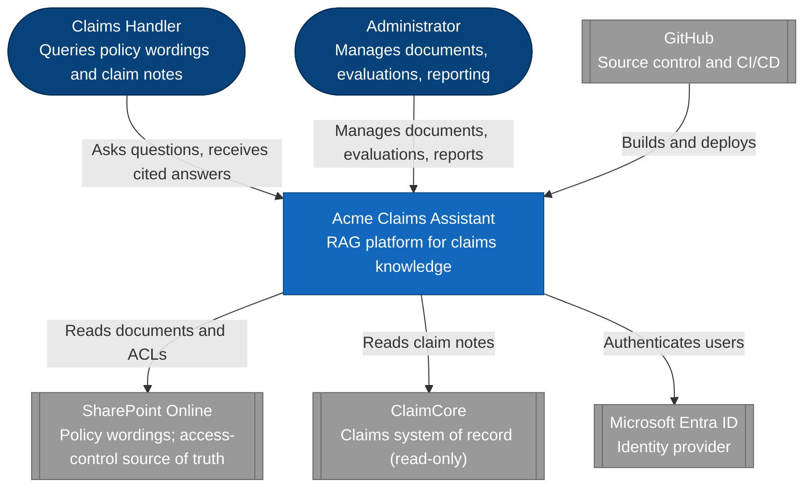
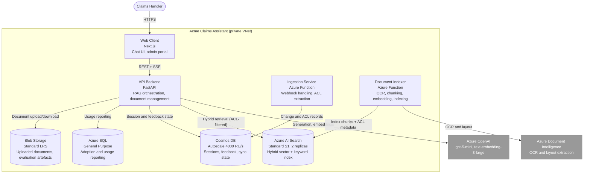
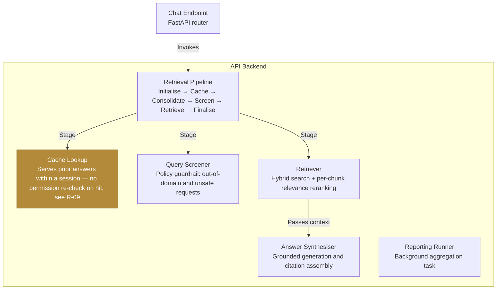
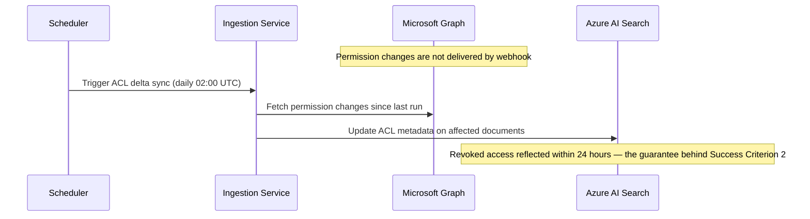

<!-- Part D of the bundled SDD authoring guide. The conventions every Part relies on (ID registry, vocabularies, omission rule, evidence, diagrams, checklist) are in 00-conventions.md. -->

## Contents of this Part

- §11 Solution overview
- §12 Domain overview
- §13 Architecture — C4 Level 1: System Context
- §14 Architecture — C4 Level 2: Container
- §15 Architecture — C4 Level 3: Component
- §16 Process pipelines & sequence diagrams
- §17 Data design
- §18 Technology stack & rationale
- §19 Interfaces & endpoints
- §20 Models & schemas
- §21 Integrations & external dependencies

---

# Part D — Solution architecture

## 11. Solution overview — `REQUIRED`

**Purpose.** The paragraph that lets a reader interpret every diagram that follows.

**How to write it.** Two to four sentences naming the major building blocks and how they relate, before any diagram. Name the technologies but not the SKUs. If a reader cannot follow §14's container diagram after reading this, rewrite it.

**Example**

> Acme Claims Assistant is a retrieval-augmented generation platform on Azure-native infrastructure: Azure OpenAI for generation and embeddings, Azure AI Search for retrieval, Cosmos DB for conversational state, and Azure SQL for reporting. Content is ingested from two sources — SharePoint Online, near-real-time via Microsoft Graph webhooks, and ClaimCore, on a scheduled read-only pull — and flows through a common indexing pipeline that applies OCR, chunking, embedding, and per-document access-control metadata. Retrieval applies the querying handler's permissions as a query-time security filter. All components run inside a private Azure virtual network peered to Acme's hub.

---

## 12. Domain overview — `OPTIONAL`

**Purpose.** Bounded contexts and their relationships, for systems with genuine business-domain complexity.

**How to write it.** Include only where multiple teams own distinct models of the same concepts, or where an anti-corruption layer between contexts is a real design element. Most internal service projects should omit this. Terminology lives in §5 — this section is about **boundaries and ownership**, not vocabulary.

**Example**

Two bounded contexts meet in this system.

* **Knowledge context** (Northwind-owned) — documents, chunks, embeddings, retrieval, answers. Owns the notion of a "source" and a "citation".
* **Claims context** (Acme-owned, in ClaimCore) — claims, policies, handlers, reserves. Owns the notion of a "claim".

The relationship is **conformist with an anti-corruption layer**: the Knowledge context consumes ClaimCore's model read-only through a translation layer in the ingestion service, and never writes back. A claim note becomes an indexed document with a claim reference attached as metadata; the Knowledge context has no concept of a claim's lifecycle and must not acquire one.

---

## 13. Architecture — C4 Level 1: System Context — `REQUIRED`

**Purpose.** The zoomed-out picture: this system, its users, and everything outside it that it talks to. No internals.

**How to write it.** One diagram, one box for the whole system. Every human actor type and every external system. Label every arrow with what actually flows. If an external system appears here and nowhere in §21 Integrations, one of the two is wrong. Publish the diagram as described in §0.7.

**Example**

_\[Rendered image goes here where the destination cannot render Mermaid — export this diagram (for example from mermaid.live) and place the PNG or SVG above the source block.\]_



---

## 14. Architecture — C4 Level 2: Container — `REQUIRED`

**Purpose.** Every deployable or runnable unit and how they connect. This is the level most readers will actually use.

**How to write it.** One diagram plus the container table — both, always. Draw the trust or network boundary explicitly. The Technology/SKU column carries the actual tier, because the tier is where cost, availability, and scaling limits live. Add a note under the table for any capacity or co-location constraint the diagram cannot express.

**Example**

_\[Rendered image goes here where the destination cannot render Mermaid — export this diagram (for example from mermaid.live) and place the PNG or SVG above the source block.\]_



| Index | Container | Technology / SKU | Description |
| --- | --- | --- | --- |
| 1 | Web client | Next.js on App Service `P1v3`, 2 instances | Chat interface and administrative portal |
| 2 | API backend | FastAPI on App Service `P1v3`, 2 instances, autoscale to 4 | RAG orchestration, document management, evaluation and reporting APIs |
| 3 | Ingestion service | Azure Functions, Elastic Premium `EP1` | Graph webhook subscriptions, delta sync, ACL extraction |
| 4 | Document indexer | Azure Functions, Elastic Premium `EP1` | OCR, chunking, embedding, index writes |
| 5 | Retrieval | Azure AI Search `Standard S1`, 2 replicas, 1 partition | Hybrid vector and keyword search with per-document ACL metadata |
| 6 | Generation | Azure OpenAI, `Standard` deployment, UK South | Answer generation and embeddings |
| 7 | Operational store | Cosmos DB, autoscale | Sessions, feedback, ingestion and subscription state |
| 8 | Reporting store | Azure SQL, General Purpose 2 vCore | Usage, adoption, and feedback reporting |
| 9 | Object store | Blob Storage `Standard LRS` | Uploaded documents, evaluation artefacts |
| 10 | CI/CD | GitHub Actions, self-hosted runner on `Standard_D2as_v5` | Build and deployment inside the private network |

**Capacity note.** The web client and API backend share one App Service Plan. Autoscale is configured on the plan, not per app — a load spike on one scales the other. Verified against the live environment on 2026-08-01. See R-02.

---

## 15. Architecture — C4 Level 3: Component — `CONDITIONAL`

**Trigger.** Include for any container with non-trivial internal structure — several collaborating modules, a multi-stage pipeline, more than one team contributing, or a security-relevant internal boundary. Omit for simple CRUD APIs and thin wrappers.

**How to write it.** One diagram per container that warrants it, and a sentence explaining **why this container earned the detail** — that sentence is how a reviewer knows the judgement was made rather than skipped. Where a component carries a known risk, colour it and label it in the diagram. Full internal detail belongs in the LLD, not here. If you include none, apply the omission rule with the reason.

**Example**

_Included for the API backend: it hosts a multi-stage retrieval pipeline, three distinct model-backed components, and a background reporting runner — enough internal structure that the container view alone would hide the security-relevant boundaries._

_\[Rendered image goes here where the destination cannot render Mermaid — export this diagram (for example from mermaid.live) and place the PNG or SVG above the source block.\]_



---

## 16. Process pipelines & sequence diagrams — `CONDITIONAL`

**Trigger.** Include whenever the system has any multi-step, asynchronous, scheduled, or event-driven flow. Omit only for pure request/response systems.

**How to write it.** One diagram per distinct flow a reviewer would need to reason about independently — do not settle for one representative example when the system genuinely has six. **Number every pipeline consecutively and give each a descriptive name**, for instance "Pipeline 3 — Daily ACL Reconciliation". Never mix numbered and unnumbered headings. Use Mermaid `Note over` blocks to carry caveats inside the diagram, where they cannot be lost.

**Example**

### Pipeline 1 — SharePoint document ingestion (near-real-time)

_\[Rendered image goes here where the destination cannot render Mermaid — export this diagram (for example from mermaid.live) and place the PNG or SVG above the source block.\]_

```mermaid
sequenceDiagram
    participant SP as SharePoint Online
    participant Graph as Microsoft Graph
    participant Ingest as Ingestion Service
    participant Cosmos as Cosmos DB
    participant Indexer as Document Indexer
    participant DocIntel as Document Intelligence
    participant OpenAI as Azure OpenAI
    participant Search as Azure AI Search

    SP->>Graph: Document added / updated / deleted
    Graph->>Ingest: Change notification (webhook)
    Ingest->>Graph: Fetch delta, extract file-level ACLs
    Ingest->>Cosmos: Write change record
    Cosmos->>Indexer: Change feed trigger
    Indexer->>SP: Download file
    Indexer->>DocIntel: OCR and layout extraction
    DocIntel-->>Indexer: Extracted text
    Indexer->>Indexer: Chunk by section boundary
    Indexer->>OpenAI: Generate embeddings
    Indexer->>Search: Index chunks + ACL metadata
    Note over Indexer,Search: The prior version stays retrievable until the replacement is fully indexed; a failed run removes nothing.
```

### Pipeline 2 — Daily ACL reconciliation

_\[Rendered image goes here where the destination cannot render Mermaid — export this diagram (for example from mermaid.live) and place the PNG or SVG above the source block.\]_



---

## 17. Data design — `CONDITIONAL`

**Trigger.** Required whenever the solution persists data. Omit only for genuinely stateless components.

**How to write it.** Logical entities and where each physically lives — this is the section that answers "where is a handler's conversation stored, and who can read it". Cover entity, store, key or partition strategy, ownership, retention, and whether it contains personal data. Do not reproduce DDL; that belongs in the LLD or the schema repository. This section is about **ownership, placement, and lifecycle**.

**Example**

| Entity | Store | Key / partition | Owner | Personal data | Retention |
| --- | --- | --- | --- | --- | --- |
| Conversation session | Cosmos DB | `session_id`, partitioned by `user_id` | Northwind | Yes — user identifier, query text | 90 days, then purged |
| Answer feedback | Cosmos DB | `feedback_id`, partitioned by `session_id` | Northwind | Yes — user identifier | 24 months (quality analysis) |
| Document chunk + embedding | Azure AI Search | `chunk_id`, ACL metadata field | Northwind | No — derived from Acme documents | Lifetime of the source document |
| Document metadata | Cosmos DB | `document_id` | Northwind | No | Lifetime of the source document |
| Uploaded document (binary) | Blob Storage | container per source | Acme | Depends on document content | Lifetime of the source document |
| Usage and adoption metrics | Azure SQL | `event_id`, indexed on date | Northwind | Pseudonymised — user object ID only | 24 months |
| Ground Truth QA pair | Blob Storage | dataset per version | Acme Claims Ops | No | Indefinite, versioned |

**Source of truth.** Acme's SharePoint and ClaimCore remain the systems of record for all content. Everything in the table above is derived, and the entire index is rebuildable from source — which is what makes the 24-hour index RPO in NFR-06 acceptable.

---

## 18. Technology stack & rationale — `REQUIRED`

**Purpose.** What was chosen, at what tier, and why. The rationale column is the point of the section — a stack list without reasoning tells a future reader nothing about what they may safely change.

**How to write it.** One row per layer. Include the SKU or tier, because the tier is where cost, availability, and scaling limits actually live. Close with a verification note stating when the table was last checked against the live environment and what evidence was used — Infrastructure-as-Code alone is not evidence of what is deployed.

**Example**

| Layer | Technology | SKU / tier | Rationale |
| --- | --- | --- | --- |
| Frontend | Next.js | App Service `P1v3`, 2 instances | Server-rendered UI with a mature Entra ID integration; two instances satisfy NFR-05 |
| Backend | FastAPI | App Service `P1v3`, autoscale 2–4 | Async-first Python, aligning with the AI SDK ecosystem |
| Retrieval | Azure AI Search | `Standard S1`, 2 replicas | Hybrid vector and keyword search with per-document security filtering; replicas for availability, not throughput |
| Generation | Azure OpenAI `gpt-5-mini` | `Standard`, UK South | Sufficient reasoning quality at materially lower cost than the full-size model; region pinned to satisfy NFR-09 |
| Embeddings | `text-embedding-3-large` | `Standard`, UK South | Retrieval precision on long-form policy language; index schema fixed to this dimensionality |
| OCR | Azure Document Intelligence | `S0` | Layout-aware extraction preserving table structure in policy schedules |
| Configuration | Azure App Configuration | `Standard` | Centralised runtime configuration and feature flags without redeployment |
| Secrets | Azure Key Vault | `Standard`, RBAC-only | No access policies; managed identity access only |
| Operational store | Cosmos DB | Autoscale 4000 RU/s | Low-latency session state with a change feed driving the indexing trigger |
| Reporting store | Azure SQL | General Purpose, 2 vCore | Relational aggregation for adoption reporting |
| Identity | Entra ID + Microsoft Graph | — | Client's existing identity provider; also the ACL source |
| Monitoring | Application Insights + Azure Monitor | — | Distributed tracing and alerting; see §31 |
| Networking | Azure Virtual Network | — | Private endpoints for every PaaS dependency; Spoke peered to Acme's Hub |

**Verification note.** This table reflects the deployment as verified against the live Acme subscription on 2026-08-01, not Infrastructure-as-Code alone. Two resources — the OpenAI model deployments and the administrative Entra group — are created outside the tracked templates; see R-07.

---

## 19. Interfaces & endpoints — `CONDITIONAL`

**Trigger.** Include for any solution exposing an API, a webhook, a message contract, or a file interface.

**How to write it.** Open with the base path, the authentication model, and — critically — **a pointer to whatever is authoritative**, usually a live OpenAPI specification. State plainly that the examples here are illustrative and that the live specification wins on conflict; this is what keeps the SDD from decaying into a stale second contract. Group endpoints by feature area once you pass about eight. For each: verb and path, authentication mode, any feature-flag gating, a one-line description, and truncated request/response shapes with inline comments.

**Example**

All endpoints are served under `/api/v1`. Bearer token authentication is required unless marked Public. Some endpoints are additionally gated by a feature flag, noted per group.

**The examples below are illustrative, not the complete contract.** Field-level validation, full nested schemas, and an interactive console are published by the service itself at `/docs` (REF-02). That live specification is authoritative — where it and this section disagree, the service wins.

### Core

`GET /health` (Public) — liveness check. No request body.

```json
// Response
{ "status": "UP" }
```

### Chat

`POST /chat` (Bearer) — generate a grounded answer.

```json
// Request
{
  "query": "string",         // the handler's question
  "session_id": "01H...",    // ULID identifying the conversation
  "claim_ref": "string|null" // optional claim context for scoping
}
```

```json
// Response
{
  "content": "string",     // generated answer
  "sources": [             // one entry per cited document, ordered by relevance
    { "document_id": "string", "title": "string", "url": "string", "score": 0.0 }
  ],
  "session_id": "01H...",
  "latency_ms": 0
}
```

### Document management _(feature flag:_ `ManualUpload`)

`POST /documents` (Bearer, administrative) — upload a document for indexing.  
`DELETE /documents/{id}` (Bearer, administrative) — remove a document and its chunks.

```json
// Response — POST /documents
{ "document_id": "string", "status": "QUEUED", "filename": "string" }
```

---

## 20. Models & schemas — `CONDITIONAL`

**Trigger.** Include for any solution with a persisted or API-facing data model.

**How to write it.** Two acceptable patterns — pick one and be consistent. **(a) Reference summary:** name each type and its fields, grouped by feature area, for consumers who will look them up by name. **(b) Narrative plus authoritative pointer:** describe what each feature area's models represent and defer field-level detail to a live specification. Pattern (b) is preferred whenever a live OpenAPI spec exists, because a hand-maintained field list will drift. Either way, cover **every** feature area with a real model, not a representative sample, and list shared enumerations separately — enums are where undocumented behaviour hides.

**Example** (pattern b)

_Grouped by feature area. Field-level detail is published by the service specification (REF-02)._

**Chat & session** — the request/response envelope for chat interactions, session listing, and session detail, including per-answer source citations and follow-up suggestions.

**Feedback** — the feedback record (interaction, session, user, message, sentiment) and its update model.

**Evaluation & Ground Truth** — evaluation run input/output, per-question and summary report models, and the Ground Truth QA-pair model including promotion tracking.

**Document management** — document metadata (source, filename, permission set, indexing status) and upload/delete responses.

**Reporting** — a shared reporting envelope (KPI items, time series, segment series) composed into per-endpoint response models.

**Shared enumerations** — `FeedbackType`, `IndexingStatus`, `EvaluationStatus`, `DocumentSource`, and `ScreeningOutcome`. `ScreeningOutcome` governs which queries are refused and is documented in §25.

---

## 21. Integrations & external dependencies — `REQUIRED`

**Purpose.** Everything outside the trust boundary that the solution relies on, and what it costs you if it fails.

**How to write it.** One entry per external system, including third-party SaaS, private package registries, and anything called at runtime — including calls you inherited rather than wrote. State access method, credential type, and failure impact. Flag single points of failure explicitly. Cross-check against §13: every external box in the L1 diagram appears here, and vice versa.

**Example**

* **SharePoint Online** — policy wording store and ACL source of truth. Accessed via Microsoft Graph with a certificate-backed service principal. Webhooks for content change; scheduled batch for permission reconciliation. **Single point of failure for all document content.**
* **ClaimCore** — claims system of record. Read-only REST pull on a 30-minute schedule, authenticated by a client credential held in Key Vault. Failure degrades scope to policy wordings only; it does not take the service down.
* **Microsoft Entra ID** — authentication and group-based authorisation for all users. **Single point of failure for all access.**
* **Azure OpenAI** — generation and embeddings. Model versions retire on Microsoft's published schedule; see §26.
* **GitHub Actions with a self-hosted runner** — build and deployment inside the private network. Failure halts deployments; running services are unaffected.
* **Private package registry** — Northwind-maintained shared libraries. Failure halts new builds; running services are unaffected.
