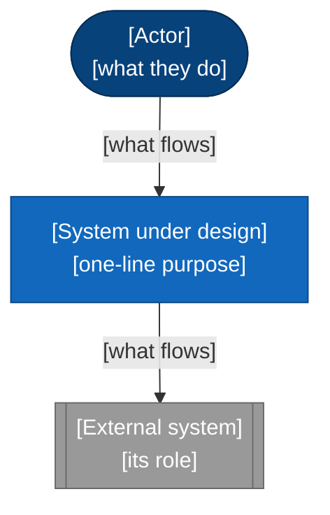
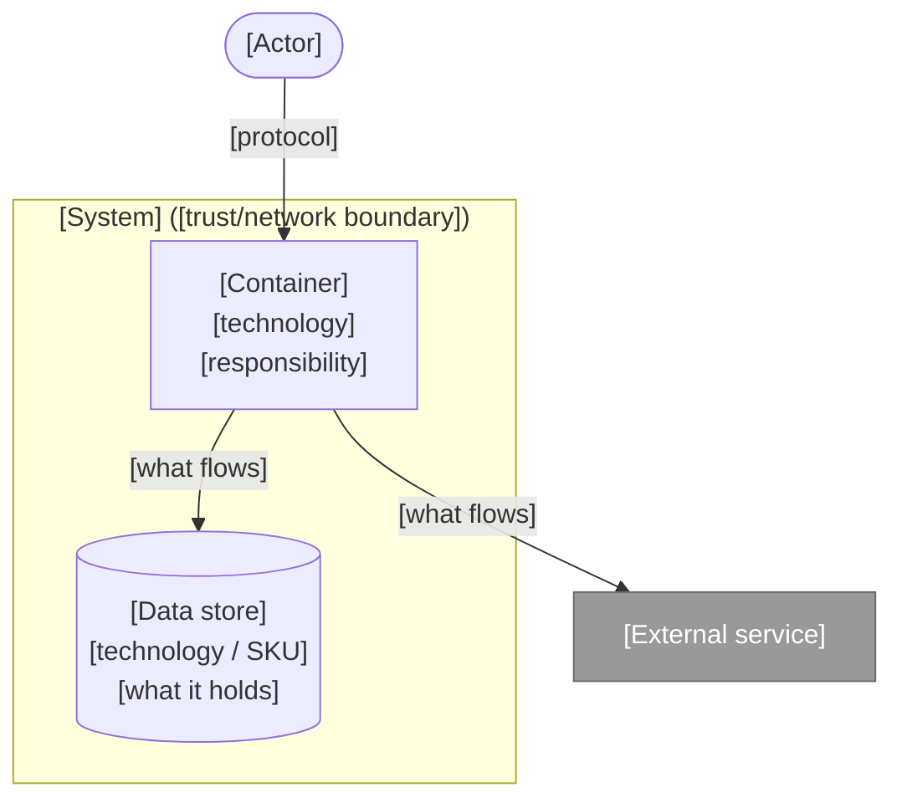
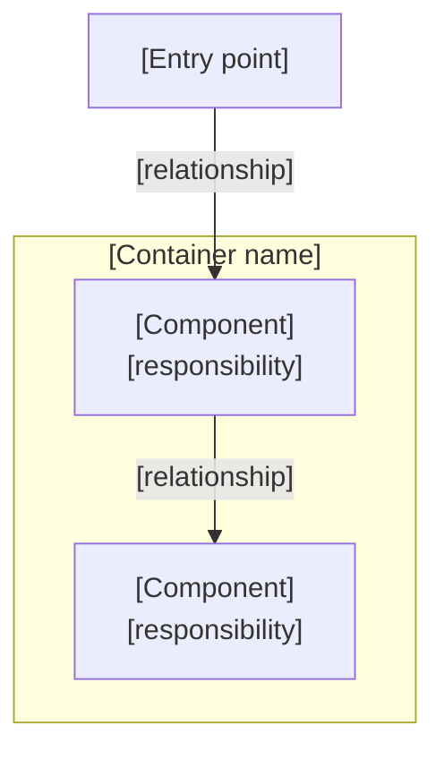
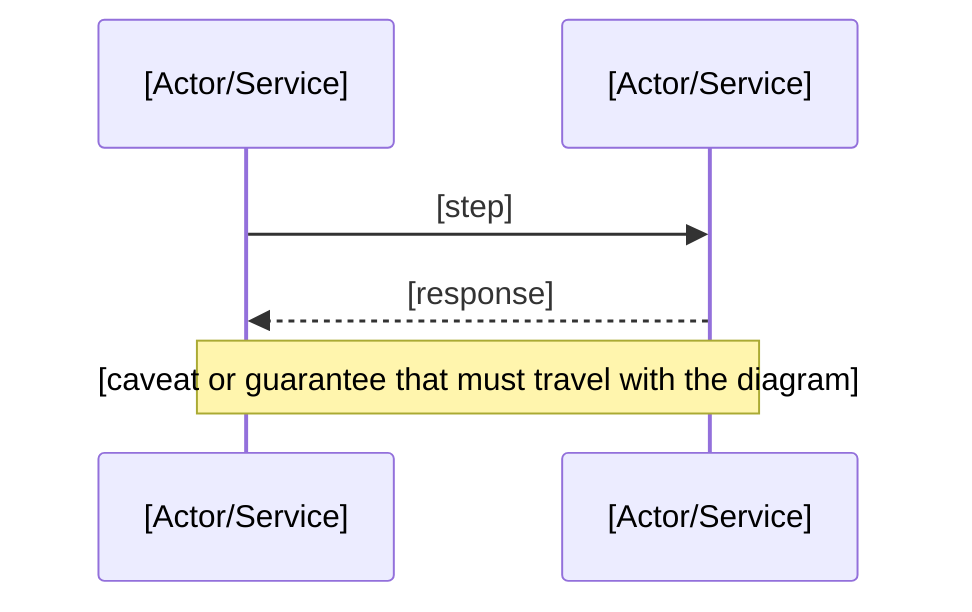

# Solution Design Document — Template v2\.0

> **Before you start — delete this box before issuing the document.**  
> Copy this page into the customer's space and rename it `[Project] — Solution Design Document`.  
> Guidance, rules, and a worked example for **every** section are in **Solution Design Document — Authoring Guide (Template v2.0)**. Keep it open beside you.  
> Section tiers: `REQUIRED` — always. `CONDITIONAL` — required when its stated trigger is true. `OPTIONAL` — your judgement. Delete the tier tag as you complete each section.  
> **Never delete a section.** If it does not apply, keep the heading and write *Not applicable — \[reason\]*.  
> ID schemes (`FR` `NFR` `A` `D` `R` `ADR` `OQ`), MoSCoW values, requirement statuses, risk severities and statuses are defined in §0.3–0.4 of the Guide. Use them exactly.  
> Run the pre-share checklist in §0.8 of the Guide before this document goes to a client.

---

# Part A — Document control

## 1. Document control `REQUIRED`

**Metadata**

|  |  |
| --- | --- |
| **Project** | \[project name\] |
| **Client** | \[client name\] |
| **Document status** | \[Draft / Issued for review / Approved\] |
| **Version** | \[n.n\] |
| **Classification** | \[e.g. Confidential — client and supplier only\] |
| **Owner** | \[name, role, organisation\] |
| **Contributors** | \[names and areas\] |
| **Audience** | \[who this is written for\] |
| **Last reviewed** | \[YYYY-MM-DD\] |
| **Next review** | \[YYYY-MM-DD or trigger\] |

**Revision history** *(append-only)*

| Version | Date | Author | Summary of change |
| --- | --- | --- | --- |
| \[n.n\] | \[YYYY-MM-DD\] | \[name\] | \[what changed\] |

**Approvals**

| Role | Name | Organisation | Date | Outcome |
| --- | --- | --- | --- | --- |
| Solution Architect | \[name\] | \[supplier\] |  |  |
| Engineering Manager | \[name\] | \[supplier\] |  |  |
| Client Technical Sponsor | \[name\] | \[client\] |  |  |
| Client Security | \[name\] | \[client\] |  |  |

---

## 2. References & related documents `REQUIRED`

| Ref | Document | Authoritative for | Location |
| --- | --- | --- | --- |
| REF-01 | \[document\] | \[what it is the source of truth for\] | \[link\] |

---

# Part B — Context and scope

## 3. At a glance `REQUIRED`

*(Write this section last.)*

\[3–5 sentences: who uses it, what it does, what it runs on, why it matters.\]

---

## 4. Business problem & goals `REQUIRED`

- \[Problem as it exists today, stated without reference to the solution.\]
- **Goal:** \[what success changes for the business or user\]
- **Success looks like:** \[measurable outcome\]

---

## 5. Glossary & ubiquitous language `REQUIRED`

| Term | Meaning |
| --- | --- |
| \[term\] | \[meaning\] |

---

## 6. Scope & assumptions `REQUIRED`

**In scope**

- \[bullet\]

**Out of scope**

- \[bullet — include the near-misses a client might reasonably assume are included\]

**Assumptions**

*\[Group under sub-headings once you pass about six.\]*

| ID | Assumption |
| --- | --- |
| A-01 | \[what is being taken as given\] |

**Dependencies**

| ID | Dependency | Owner | Impact if blocked |
| --- | --- | --- | --- |
| D-01 | \[dependency\] | \[named owner\] | \[consequence\] |

---

## 7. Success criteria `REQUIRED`

1. **\[Criterion name\]** — \[measurable, verifiable statement\]
2. **\[Criterion name\]** — \[measurable, verifiable statement\]

---

# Part C — Requirements

## 8. Functional requirements `REQUIRED`

*Reserve the full ID range up front. Status goes in the Status column only — never in Priority, never in Stakeholders.*

| ID | Category | Requirement | Acceptance criteria | Priority | Stakeholders | Status |
| --- | --- | --- | --- | --- | --- | --- |
| FR-01 | \[category\] | \[requirement\] | Given \[context\], when \[action\], then \[outcome\] | \[Must / Should / Could / Won't\] | \[who\] | \[status\] |
| FR-02 |  |  |  |  |  |  |
| FR-03 |  |  |  |  |  |  |

---

## 9. Non-functional requirements `REQUIRED`

*Cover or explicitly dismiss each category: Performance · Capacity & throughput · Availability · Recoverability (RTO/RPO) · Scalability · Security · Privacy & data protection · Data residency · Interoperability · Maintainability · Observability · Accessibility · Portability · Compliance · Localisation.*

| ID | Category | Requirement | Acceptance criteria / threshold | Priority | Stakeholders | Status |
| --- | --- | --- | --- | --- | --- | --- |
| NFR-01 | Performance | \[requirement\] | \[measurable threshold\] | \[Must / Should / Could / Won't\] | \[who\] | \[status\] |
| NFR-02 | Availability |  |  |  |  |  |
| NFR-03 | Recoverability | RTO / RPO |  |  |  |  |
| NFR-04 | Security |  |  |  |  |  |

---

## 10. Traceability `REQUIRED`

*If traceability is maintained in a tracker, state that and link it here instead of duplicating a live tracker into a static page. Every Must requirement must appear either way.*

| Requirement | Design reference | Verified by | Status |
| --- | --- | --- | --- |
| \[FR-nn\] | \[§ reference\] | \[test ID / UAT ID\] | \[status\] |

---

# Part D — Solution architecture

## 11. Solution overview `REQUIRED`

\[2–4 sentences naming the major building blocks and how they relate, before any diagram.\]

---

## 12. Domain overview `OPTIONAL`

*Include only where multiple teams own distinct models of the same concepts, or where an anti-corruption layer between contexts is a real design element. Terminology belongs in §5 — this section is about boundaries and ownership.*

\[Bounded contexts, what each owns, and the relationship between them.\]

---

## 13. Architecture — C4 Level 1: System Context `REQUIRED`

*\[Rendered image goes here where the destination cannot render Mermaid — export this diagram (for example from mermaid.live) and place the PNG or SVG above the source block.\]*



---

## 14. Architecture — C4 Level 2: Container `REQUIRED`

*\[Rendered image goes here where the destination cannot render Mermaid — export this diagram (for example from mermaid.live) and place the PNG or SVG above the source block.\]*



| Index | Container | Technology / SKU | Description |
| --- | --- | --- | --- |
| 1 | \[container\] | \[technology, tier, instance count\] | \[responsibility\] |

**Capacity note.** \[Any co-location, shared-plan, or scaling constraint the diagram cannot express, with the date it was verified against the live environment.\]

---

## 15. Architecture — C4 Level 3: Component `CONDITIONAL`

*Trigger: a container with non-trivial internal structure — several collaborating modules, a multi-stage pipeline, more than one contributing team, or a security-relevant internal boundary. Omit for simple CRUD APIs and thin wrappers.*

*\[One sentence stating why this container earned the detail.\]*

*\[Rendered image goes here where the destination cannot render Mermaid — export this diagram (for example from mermaid.live) and place the PNG or SVG above the source block.\]*



---

## 16. Process pipelines & sequence diagrams `CONDITIONAL`

*Trigger: any multi-step, asynchronous, scheduled, or event-driven flow. Number every pipeline consecutively and give each a descriptive name — never mix numbered and unnumbered headings.*

### Pipeline 1 — \[descriptive name\]

*\[Rendered image goes here where the destination cannot render Mermaid — export this diagram (for example from mermaid.live) and place the PNG or SVG above the source block.\]*



### Pipeline 2 — \[descriptive name\]

*\[Repeat the pattern — one diagram per flow a reviewer must reason about independently.\]*

---

## 17. Data design `CONDITIONAL`

*Trigger: the solution persists data. Omit only for genuinely stateless components. Do not reproduce DDL — this section is about ownership, placement, and lifecycle.*

| Entity | Store | Key / partition | Owner | Personal data | Retention |
| --- | --- | --- | --- | --- | --- |
| \[entity\] | \[store\] | \[key strategy\] | \[owner\] | \[Yes / No / Pseudonymised\] | \[period\] |

**Source of truth.** \[Which systems are systems of record, what here is derived, and what is rebuildable.\]

---

## 18. Technology stack & rationale `REQUIRED`

| Layer | Technology | SKU / tier | Rationale |
| --- | --- | --- | --- |
| \[layer\] | \[technology\] | \[tier\] | \[why this, at this tier\] |

**Verification note.** \[When this table was last checked against the live environment, and what evidence was used. Name anything deployed outside Infrastructure-as-Code.\]

---

## 19. Interfaces & endpoints `CONDITIONAL`

*Trigger: the solution exposes an API, a webhook, a message contract, or a file interface.*

\[Base path, authentication model, and — critically — a pointer to whatever is authoritative, usually a live OpenAPI specification. State that the examples below are illustrative and that the live specification wins on conflict.\]

### \[Feature area\]

`[VERB] /[path]` (\[auth mode\]) *(feature flag: \[flag\], if applicable)* — \[one-line description\].

```json
// Request
{ "field": "type" }   // [what it is]
```

```json
// Response
{ "field": "type" }   // [what it is]
```

---

## 20. Models & schemas `CONDITIONAL`

*Trigger: the solution has a persisted or API-facing data model. Pick one pattern — a field-level reference summary, or a narrative plus a pointer to the authoritative live specification — and be consistent. Cover every feature area with a real model, not a sample.*

**\[Feature area\]** — \[what these models represent\].

**Shared enumerations** — `[EnumName]` (\[VALUE\_A\] / \[VALUE\_B\] / …), and what each governs.

---

## 21. Integrations & external dependencies `REQUIRED`

- **\[External system\]** — \[what it is used for, how it is accessed, credential type, and the impact if it fails\]. \[Flag single points of failure explicitly.\]

---

# Part E — Cross-cutting concerns

## 22. Cross-cutting policy `REQUIRED`

*Fill every row. Promote a row to its own subsection below whenever it carries an open caveat, an unresolved recommendation, more than one mechanism, or more than two or three sentences of real nuance.*

| Concern | Policy |
| --- | --- |
| Authentication | \[policy\] |
| Authorisation | \[policy\] |
| Secrets management | \[policy\] |
| Data & retention | \[policy\] |
| Encryption | \[in transit and at rest\] |
| Observability | \[policy\] |
| Networking | \[policy\] |
| Scaling & cost | \[policy\] |
| Supply chain | \[policy\] |
| Business continuity | \[policy\] |

### \[Promoted concern\] *(promoted — \[reason\])*

\[Prose treatment, with the caveat stated in full.\]

---

## 23. Security & identity `REQUIRED`

**Access matrix**

| Capability | \[Role A\] | \[Role B\] | Service identity | Enforcement point |
| --- | --- | --- | --- | --- |
| \[capability\] | \[Yes / No / conditional\] | \[Yes / No / conditional\] | \[Yes / No\] | \[where this is actually enforced\] |

**Threat model.** \[Method, date, scope, findings raised and closed, and what triggers reassessment. If no threat model has been performed, say so plainly and raise a risk.\]

**Least privilege note.** \[How service-principal and managed-identity permissions are reviewed, and the justification for any shared credential.\]

---

## 24. Compliance & data protection `CONDITIONAL`

*Trigger: the solution processes personal data, regulated data, or client-confidential content.*

- **Data classification.** \[classification and what carries it\]
- **Lawful basis / controller-processor position.** \[statement, and the agreement it rests on\]
- **Residency.** \[where storage, compute, and any model inference occur\]
- **Sub-processors.** \[named, with what each processes\]
- **Privacy impact assessment (DPIA or equivalent).** \[status, owner, target date\]
- **Penetration test / security review.** \[status, scope, and what go-live is gated on\]
- **Right to erasure / data subject requests.** \[how they are satisfied\]

---

## 25. Responsible AI `CONDITIONAL`

*Trigger: the solution uses generative AI or automated decision-making.*

- **Permitted use.** \[what the system is for\]
- **Prohibited use.** \[what it must never be used for, and how that boundary is communicated\]
- **Platform content filtering.** \[policy, thresholds, and when it was verified against the live resource\]
- **Application screening.** \[the exact categories screened, and what a refusal looks like\]
- **Grounding.** \[how hallucination is controlled, and what happens when retrieval returns nothing\]
- **Human oversight.** \[attribution, logging, and the human decision point\]
- **Evaluation.** \[approach, dataset, thresholds, and what invalidates a baseline\]
- **Known limitations.** \[stated honestly\]

---

## 26. Model & platform lifecycle `CONDITIONAL`

*Trigger: the solution depends on a vendor-versioned model or a service with a published retirement schedule.*

| Component | Current version | Retirement | Tracked by | Migration impact |
| --- | --- | --- | --- | --- |
| \[component\] | \[version\] | \[date or schedule\] | \[named owner\] | \[what a version change forces — say explicitly if it invalidates a baseline or requires a full rebuild\] |

**Standing obligation.** \[How and when retirement dates are reviewed, and what triggers a risk entry.\]

---

## 27. Accessibility `CONDITIONAL`

*Trigger: the solution has a human-facing interface.*

Target: \[standard and level\]. Audit status: \[audited / not audited — an unaudited interface is not a conformant one\].

Implemented: \[what has been done\].

Known non-conformance: \[what fails, against which success criterion, and the remediation plan\].

Localisation: \[interface language versus content language, and whether that is a conformance matter\].

---

# Part F — Delivery and operations

## 28. Environments `REQUIRED`

*Include environments that are planned but not yet built. Do not publish tenant, subscription or account IDs, or resource GUIDs, in a client-shared document.*

| Attribute | \[Environment 1\] | \[Environment 2\] | \[Environment 3\] |
| --- | --- | --- | --- |
| Purpose |  |  |  |
| Owner |  |  |  |
| Region |  |  |  |
| Data | \[synthetic / anonymised / live\] |  |  |
| Access |  |  |  |
| Deployment |  |  |  |
| Status |  |  |  |

---

## 29. Release, cutover & rollback `REQUIRED`

- **Branching.** \[model\]
- **Promotion.** \[path from merge to production, and the approval gates\]
- **Deployment method.** \[how application and infrastructure reach an environment\]
- **Downtime.** \[expected impact per deployment, and the window it fits in\]
- **Rollback.** \[procedure, measured duration, and **when it was last rehearsed** — an unrehearsed rollback is not a rollback plan\]
- **Data.** \[migration, schema change handling, and whether data rolls back with the application\]
- **Post-deployment verification.** \[smoke checks that run automatically, and what a failure triggers\]

---

## 30. Testing & acceptance `REQUIRED`

| Level | Scope | Owner | Target |
| --- | --- | --- | --- |
| Unit |  |  |  |
| Integration |  |  |  |
| End-to-end |  |  |  |
| Performance |  |  |  |
| Security |  |  |  |
| Accessibility |  |  |  |
| UAT |  |  |  |

**UAT entry criteria.** \[what must be true before UAT begins\]

**UAT exit criteria.** \[what must be true before sign-off — without these, UAT never ends\]

**Defect management.** \[where defects are raised, how severity is assigned, and who arbitrates a dispute\]

---

## 31. Operations & support `REQUIRED`

**Monitoring & alerting**

| Signal | Threshold | Action |
| --- | --- | --- |
| \[signal\] | \[numeric threshold\] | \[page / alert / ticket\] |

**Backup & restore.** \[what is backed up, retention, what is deliberately not backed up and why, and **the date restore was last rehearsed**.\]

**Disaster recovery.** \[procedure, the RTO/RPO it is measured against, and **the date it was last rehearsed**.\]

**Support model**

| Tier | Responsibility | Hours | Response target |
| --- | --- | --- | --- |
| Tier 1 |  |  |  |
| Tier 2 |  |  |  |
| Tier 3 |  |  |  |

**Runbooks.** \[where they live, and which scenarios are covered\]

---

## 32. Sizing & cost `REQUIRED`

**Fixed monthly cost — estimate dated \[YYYY-MM-DD\], at \[pricing basis\]**

| Component | Sizing | Indicative monthly |
| --- | --- | --- |
| \[component\] | \[tier, instances\] | \[value\] |

**Variable cost drivers.** \[what scales the bill, and with what\]

**Assumptions behind the estimate.** \[volumes, user counts, corpus size, growth rate\]

**Cost controls.** \[budget alerting, and the levers available without a deployment\]

---

# Part G — Decisions, risks and open items

## 33. Key decisions `REQUIRED`

*Only reference an ADR that exists. If a significant change was made without one, either write the ADR or describe the change without a reference — never point at an unrelated ADR ID.*

- **\[Decision\]** — \[one-sentence reason\]. See ADR-\[nnnn\].

---

## 34. Architecture Decision Records `REQUIRED`

*Use this inline table, or dedicated ADR pages linked from §33 — pick one route and say which. Every ADR ID means exactly one decision, forever.*

| ID | Date | Status | Decision | Alternatives rejected | Consequences |
| --- | --- | --- | --- | --- | --- |
| ADR-0001 | \[YYYY-MM-DD\] | \[Accepted / Superseded by ADR-nnnn\] | \[what was decided\] | \[what was not chosen\] | \[what improved **and what got worse**\] |

---

## 35. Risks, dependencies & constraints `REQUIRED`

*Mandatory on every project. Include every known risk, not a representative sample. Every Critical and High risk carries a named owner and either a date or an explicit decision.*

| ID | Risk / constraint | Severity | Mitigation | Owner | Status |
| --- | --- | --- | --- | --- | --- |
| R-01 | \[risk\] | \[Critical / High / Medium / Low\] | \[mitigation\] | \[named owner\] | \[Open / Mitigating / Control in place / Accepted / Closed\] |

*Ownership note. \[Where ownership sits, and where it should be revisited jointly.\]*

---

## 36. Outcomes & deliverables `OPTIONAL`

*For in-flight work reviewed release over release. Omit for a single-issue design document.*

| Deliverable | Status | Note |
| --- | --- | --- |
| \[deliverable\] | \[Not started / In progress / Blocked / Done / Backlog\] | \[the "why" behind the status\] |

---

## 37. Open questions `REQUIRED`

*Keep resolved questions in the table with their resolution and date.*

| ID | Question | Owner | Needed by | Status / resolution |
| --- | --- | --- | --- | --- |
| OQ-01 | \[question\]? | \[named owner\] | \[YYYY-MM-DD\] | \[Open / Resolved YYYY-MM-DD — outcome\] |

---

*Living document. Part of the \[project\] document set, per your delivery documentation standard. Authored against Solution Design Document — Template v2.0; guidance in the companion Authoring Guide.*
