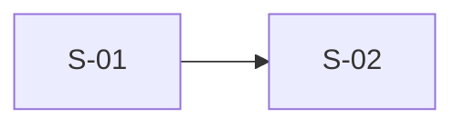

# <Feature name> Specs

- **Source PRD:** <path, URL or Confluence page of the PRD>
- **Date:** <today's date, YYYY-MM-DD>
- **Repositories:** <root folder name of each repository>
- **Audience and success signal:** <who this is for and what would tell the user it worked, from the opening interview question>

## Open gaps

<One bullet per [GAP: ...] in this document, grouped by who can resolve it, as the user named them ("Unassigned" when the user does not know), each naming its spec ID. Write "None." when there are no gaps.>

## Feature design

### Components touched

| Component | What changes | Evidence |
|---|---|---|
| <component> | <what changes> | `<path/to/file.py:120>` |

### Data flow

### Decisions

#### D-01 <decision title>

- **Decision:** <what was decided>
- **Decided by:** <the user, or the document the decision came from>
- **Alternatives shown:** <the other options put to the user>

### Spec dependencies

## Specs

### S-01 <spec title>

- **Status:** Ready
- **Story:**
- **Repo:** <the root folder name of the one repository this spec changes>
- **Depends on:** none

**User story:** As a <role>, I want <capability>, so that <benefit>.

**Scope:**

- In: <what this spec delivers>
- Out: <what it leaves to other specs or later>

**Acceptance criteria:**

1. <A complete sentence a non-engineer could verify.>

**Technical approach:** <Which modules or seams change and which existing pattern it follows, with `path/to/file.py:120` evidence.>

**INVEST:**

| Criterion | Result | Reason |
|---|---|---|
| Independent | Pass | <one-line reason> |
| Negotiable | Pass | <one-line reason> |
| Valuable | Pass | <one-line reason> |
| Estimable | Pass | <one-line reason> |
| Small | Pass | <one-line reason> |
| Testable | Pass | <one-line reason> |

**Gaps:**

- None.

**PRD trace:** <the PRD sections this spec comes from>

## PRD findings

| Id | Claim or finding | Verdict | Evidence |
|---|---|---|---|
| F-01 | <what the PRD claims or what the scan found> | <TRUE, FALSE, PARTIAL or GAP> | `<path/to/file.py:120>` |

## Change log

| Date | Change | Specs affected |
|---|---|---|
| <YYYY-MM-DD> | Created from <PRD reference>. | <spec IDs> |
